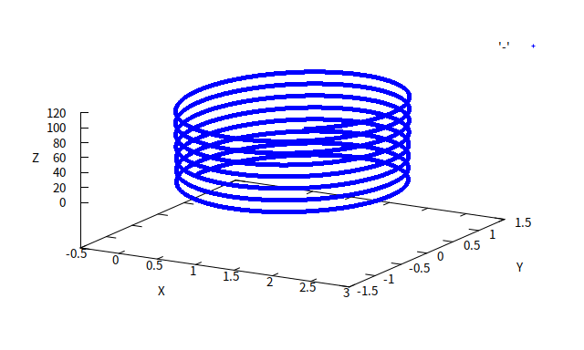
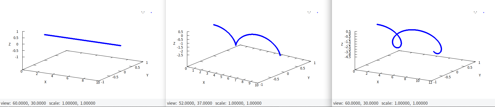

# Cartesian 3D Vector lib Example Collection
Cartesian 3D Vector lib is a simple vector library written in plain C for educational purpose.

##Introduction

This directory includes some practical examples.

For compilation, all the object files and the executables would be placed in `/build`. 

## Directory

### Random Walk

This example simulates the situation of [random walk](https://en.wikipedia.org/wiki/Random_walk). 

### Magnetic Field

This example demonstrates the loci of a charged particle moving in a magnetic field. Plotted with `Gnuplot`.

The diagram shows a charged particle starts at origin with initial velocity <0,5,5>. It has mass 0.01 kg and charge +0.001 C. The magnetic field points towards <0,0,8>.

This example uses a few more libs to calculate. They are presented in `libfields`.

### Velocity Selector

Simulation of the path of a charged particle in a giant velocity selector.

